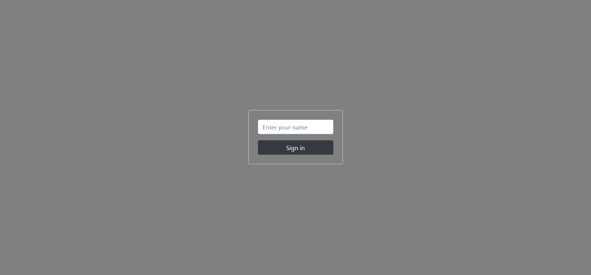
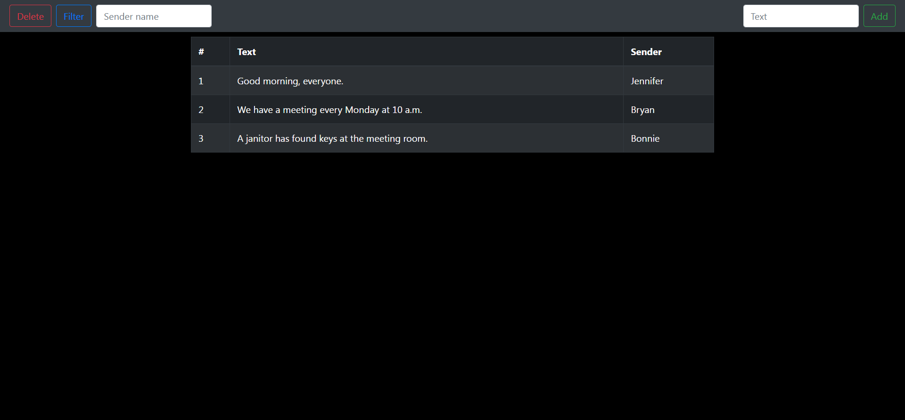

# messageService

[//]: # (> Outline a brief description of your project.)
[//]: # (> Live demo [_here_]&#40;https://www.example.com&#41;. <!-- If you have the project hosted somewhere, include the link here. -->)

## Table of Contents
* [General Info](#general-information)
* [Technologies Used](#technologies-used)
* [Features](#features)
* [Screenshots](#screenshots)
* [Project Status](#project-status)

## General Information
- The Spring Boot message service 

## Technologies Used
- Java - version 17
- Spring Boot - version 3
- PostgreSQL - version 9
- Thymeleaf - version 3
- Bootstrap - version 4

## Features
- Identification process
- Add messages to database
- Delete messages from database
- Filter messages by sender name

## Screenshots

## Project Status
Project is: _complete_ 

